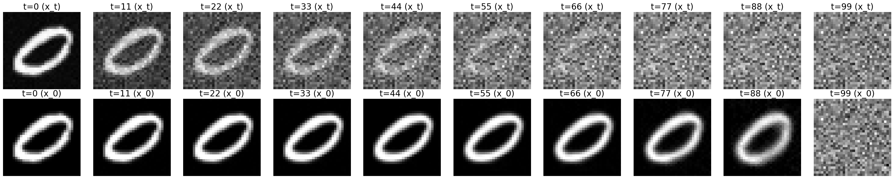
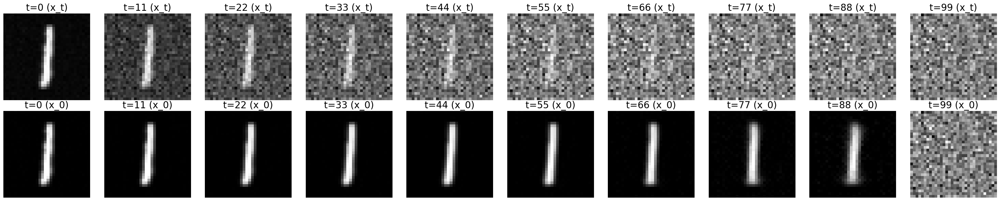
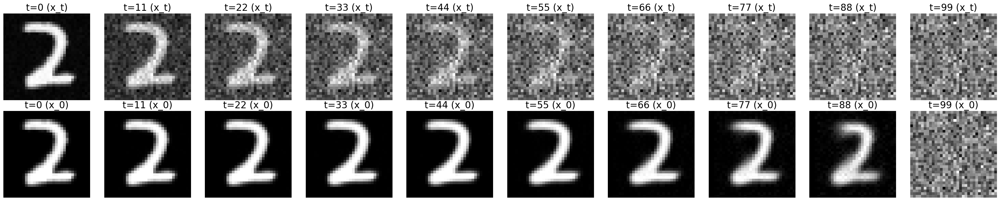
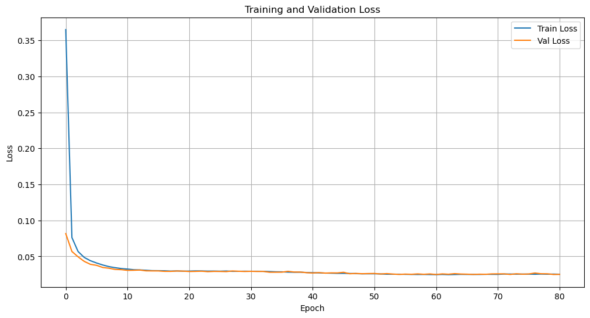
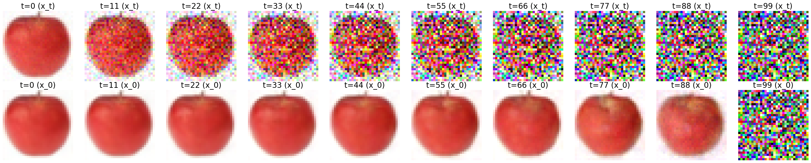
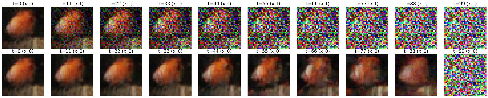
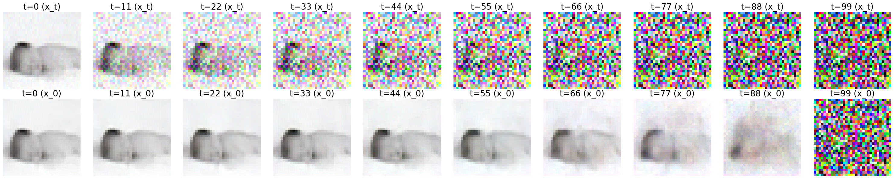
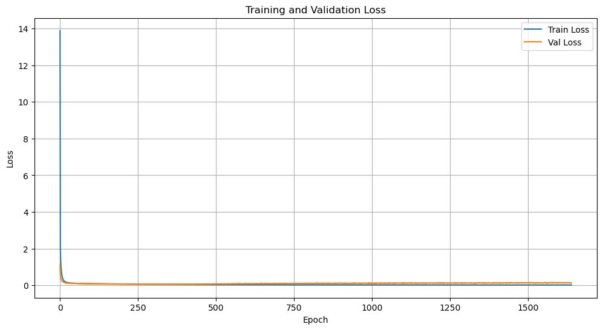

# DDPM for Image and Multi-frame (Video-like) Generation

A PyTorch implementation of Denoising Diffusion Probabilistic Models (DDPM) for generating single images and multi-frame sequences (which can be interpreted as short videos). This project explores various UNet architectures and conditioning methods, with a focus on flexible dimensionality to support sequential data.

## Features

- **Core DDPM Implementation**: Complete forward (noising) and reverse (denoising) diffusion processes.
- **Multi-frame (Video-like) Generation**: Supports generating sequences of images using the `depth_channel` parameter in configurations, enabling the creation of short, animated outputs.
- **Multiple Network Architectures**:
  - **Bottleneck UNet**: Standard UNet with attention at the bottleneck.
  - **Early Fusion UNet**: Optimized for early fusion of conditions.
  - **OpenAI UNet**: Based on OpenAI's improved diffusion implementation.
- **Flexible Conditioning**: Supports class embeddings, time embeddings, and self-conditioning.
- **Custom Noise Schedulers**: Linear, Cosine, and Sigmoid beta schedules.
- **Visualization Tools**: Utilities for plotting loss curves, visualizing forward/reverse diffusion steps, and calculating metrics (Wasserstein, KL).

## Directory Structure

```
DDPM_IMG/
├── src/                # Source code
│   ├── diffusion.py    # Main DDPM logic (DiffusionModel class)
│   ├── dataset.py      # Dataset loading and preprocessing
│   ├── config.py       # Configuration and argument parsing
│   ├── models/         # Neural network architectures (UNets)
│   └── utils/          # Helper functions and plotting tools
├── configs/            # YAML configuration files (MNIST, CIFAR100)
├── notebooks/          # Jupyter notebooks for demos and inference
│   └── demo_inference.ipynb
├── results/            # Generated images and model checkpoints
│   ├── CIFAR100_Results/
│   └── MNIST_Results/
├── scripts/            # Training and testing scripts
│   ├── train.py
│   └── run.sh          # Utility script for running train/sample/visualize modes
└── requirements.txt    # Python dependencies
```

## Installation

1.  **Clone the repository:**
    ```bash
    git clone <your-repo-url>
    cd DDPM_IMG
    ```

2.  **Install dependencies:**
    ```bash
    pip install -r requirements.txt
    ```

## Usage

This project uses `main.py` as a central entry point, orchestrated by `run.sh` for convenience.

### General Options

All commands can be passed additional arguments to `main.py`. Common arguments include:

*   `--device [cuda|cpu|mps]`: Specify the compute device (default: `cuda` if available).
*   `--config_name [mnist|cifar100]`: Specify the base configuration to load.
*   `--unet_choice [bottleneck|earlyfusion|uniform|openai|test_unet]`: Select the UNet architecture.
*   `--depth_channel [int]`: Set the number of frames per data point for multi-frame generation (default: `1` for single image).

### 1. Training a Model

To train a DDPM model:

```bash
./run.sh train [additional_args_for_main.py]
```

**Example: Train Bottleneck UNet on CIFAR-100 for 200 epochs**

```bash
./run.sh train --num_epochs 200 --dataset CIFAR100 --unet_choice bottleneck --depth_channel 1 # For single images
# For multi-frame (e.g., 4 frames):
# ./run.sh train --num_epochs 200 --dataset CIFAR100 --unet_choice bottleneck --depth_channel 4
```

Models will be saved in the `results/` directory.

### 2. Sampling Images/Multi-frames

To generate new samples from a trained model:

```bash
./run.sh sample <path_to_model_checkpoint.pth> [additional_args_for_main.py]
```

**Example: Sample from a trained MNIST model**

```bash
./run.sh sample results/MNIST_Results/Bottleneck2D/MNIST_bottleneck_diffusion_model.pth --config_name mnist --unet_choice bottleneck --depth_channel 1
# Example: Sample multi-frame output (if model was trained for it)
# ./run.sh sample results/CIFAR100_Results/my_multiframe_model.pth --config_name cifar100 --unet_choice bottleneck --depth_channel 4
```

Generated samples will be saved in `results/samples/`.

### 3. Visualizing Diffusion Processes

To visualize the forward and reverse (DDIM) diffusion processes:

```bash
./run.sh visualize <path_to_model_checkpoint.pth> [additional_args_for_main.py]
```

**Example: Visualize diffusion for a trained model**

```bash
bash ./run.sh visualize results/MNIST_Results/Bottleneck2D/MNIST_bottleneck_diffusion_model.pth --config_name mnist --unet_choice bottleneck
```

### Jupyter Notebook Demo

Explore `notebooks/demo_inference.ipynb` for an interactive step-by-step demonstration of loading data, initializing models, and performing inference and visualization, including multi-frame outputs.

## Visual Results

Here are some sample generated images and loss curves from our experiments. For multi-frame outputs, consider replacing static images with GIFs to better showcase the "video-like" generation.

### MNIST Digits Generation (Bottleneck2D UNet)

**Generated Samples:**



_Sample MNIST digits generated by the DDPM._

**Training Loss Curve:**

_Training loss over epochs for MNIST dataset._

### CIFAR-100 Animal Generation (Bottleneck_2D UNet)

**Generated Samples:**



_Sample CIFAR-100 images generated by the DDPM._

**Training Loss Curve:**

_Training loss over epochs for CIFAR-100 dataset._

## References
1. [Denoising Diffusion Probabilistic Models (Ho et al., 2020)](https://arxiv.org/abs/2006.11239)
2. [Improved Denoising Diffusion Probabilistic Models (Nichol & Dhariwal, 2021)](https://arxiv.org/abs/2102.09672)
3. Code references:
   - [lucidrains/denoising-diffusion-pytorch](https://github.com/lucidrains/denoising-diffusion-pytorch)
   - [openai/improved-diffusion](https://github.com/openai/improved-diffusion)
   - [tqch/ddpm-torch](https://github.com/tqch/ddpm-torch)